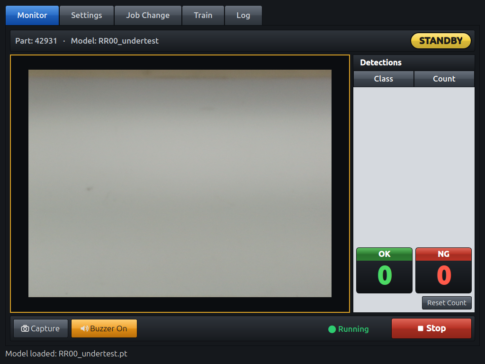

# UniversalV1 — Wire Harness Vision Inspection

**English** · [ภาษาไทย](#ภาษาไทย)

A Keyence-style inspection station for wire harnesses. A USB camera and a YOLO model decide **OK / NG / STANDBY**, and a PATLITE tower light and buzzer signal the result. It runs as a full-screen touch kiosk on an NVIDIA Jetson Orin Nano.



📘 **User manual:** [English](docs/USER_MANUAL_EN.md) · [ภาษาไทย](docs/USER_MANUAL_TH.md)

## Features

- **Live detection:** Ultralytics YOLO runs on the Jetson GPU (CUDA). You can filter by confidence, class and a maximum number of detections.
- **Judgement and outputs:**
  - OK / NG / STANDBY, using one or two target classes combined with AND / OR.
  - PATLITE LR6-USB tower light: green = OK, red = NG, yellow = STANDBY.
  - NG alarm buzzer, with a short beep on OK.
  - A state hold time (default 1 s) stops the light and buzzer from flickering.
- **OK / NG cycle counters:** large tiles that are saved across restarts.
- **Log tab:**
  - Every NG is saved as an image, grouped by part number.
  - Thumbnails open a full-screen view with pinch-to-zoom.
- **Job Change:**
  - One job per part number stores the model, filters and target classes.
  - Jobs are switched with touch tiles or a barcode scanned by the camera (Code 39 / AIM extended).
- **Capture and Train:**
  - **Capture** saves frames with YOLO labels.
  - The Train tab lets you correct a box's class and fine-tune the model on the device.
- **Kiosk mode:**
  - Starts full screen on boot through a systemd user service.
  - Reloads the last job automatically.

## Hardware

| Item | Used here |
|---|---|
| Computer | NVIDIA Jetson Orin Nano (JetPack, CUDA 13) |
| Camera | USB UVC camera (V4L2) |
| Tower light | PATLITE LR6-USB (VID `191a`, PID `8003`) |
| Display | 1024×768 touch panel (ILITEK multi-touch) |

## Installation

```bash
git clone https://github.com/natn2014/UniversalV1.git
cd UniversalV1

# System library for barcode decoding
sudo apt install libzbar0

# Python environment
python3 -m venv .venv
source .venv/bin/activate

# 1) Install CUDA-enabled torch FIRST (matches the Jetson's CUDA)
pip install torch torchvision --index-url https://pypi.org/simple
# 2) Then the rest
pip install -r requirements.txt
```

> Install `opencv-python-headless`, not `opencv-python`. The non-headless build brings its own Qt plugins, and they clash with PySide6.

### Tower light permissions (udev)

```bash
sudo cp deploy/99-patlite-lr6.rules /etc/udev/rules.d/
sudo udevadm control --reload-rules && sudo udevadm trigger
sudo usermod -aG plugdev $USER    # log out/in afterwards
```

## Running

```bash
source .venv/bin/activate
python3 main.py
```

The window opens full screen. Choose a model and camera in **Settings**, or pick a job in **Job Change**, then press **Start** on the Monitor tab.

## Kiosk autostart (boot → app)

1. Install the user service:

   ```bash
   mkdir -p ~/.config/systemd/user
   cp deploy/wire-harness-detector.service ~/.config/systemd/user/
   systemctl --user daemon-reload
   systemctl --user enable --now wire-harness-detector.service
   ```

   The service file contains absolute paths (`/home/orin_nano/dev/Wire_harness_module`). Edit them if you clone the repo somewhere else.

2. Enable automatic login, so the desktop session and the app start without a keyboard. In `/etc/gdm3/custom.conf`, under `[daemon]`:

   ```ini
   AutomaticLoginEnable = true
   AutomaticLogin = orin_nano
   ```

3. Useful commands:

   ```bash
   systemctl --user status  wire-harness-detector.service
   systemctl --user restart wire-harness-detector.service
   systemctl --user stop    wire-harness-detector.service   # before running main.py by hand
   journalctl --user -u wire-harness-detector.service -f    # live log
   ```

Only one copy of the app can use the camera and tower light at a time. Stop the service before starting `main.py` manually.

## Project layout

| Path | Purpose |
|---|---|
| `main.py` | The application (PySide6 UI, camera and YOLO worker, tower light, jobs, training) |
| `patlite_lr6.py` | PATLITE LR6-USB driver (from [TowerLightUSB](https://github.com/natn2014/TowerLightUSB)) |
| `part_configs/<part>.json` | Saved jobs, one per part number |
| `*.pt`, `weights/` | YOLO models |
| `deploy/` | systemd service and udev rule |
| `docs/` | User manuals and screenshots |
| `.claude/skills/industrial-hmi-ui/` | Claude Code skill: this app's UI/UX design system (theme module `industrial_theme.py`, layout recipes) for reuse in other apps |
| `app_settings.json` *(runtime)* | Buzzer, hold time and OK/NG counters (git-ignored) |
| `ng_logs/` *(runtime)* | NG images, `ng_logs/<part>/<timestamp>.jpg` (git-ignored) |
| `captures/` *(runtime)* | **Capture** images and YOLO labels (git-ignored) |

## Troubleshooting

| Symptom | Check |
|---|---|
| "Tower Light: Not Connected" | Check the USB cable and the udev rule above. Make sure no other copy of the app is running. |
| Camera does not open | Another process is using it: the service, a second app, or the barcode dialog. Stop it, then press **Scan Cameras** in Settings. |
| App restarts in a loop after boot | Run `journalctl --user -u wire-harness-detector.service`. The service must not hard-code `DISPLAY`. |
| First Start takes about 10 s | Normal. The GPU compiles its kernels on the first inference (Orin is compute capability 8.7). |
| Training is killed | The device ran out of RAM. Training already uses batch 8 and workers 0. Close other programs and stop the Monitor stream. |

---

## ภาษาไทย

[English](#universalv1--wire-harness-vision-inspection) · **ภาษาไทย**

ระบบตรวจสอบชุดสายไฟ (Wire Harness) ด้วยกล้อง ออกแบบหน้าจอแบบ Keyence ใช้กล้อง USB ร่วมกับโมเดล YOLO ตัดสินผล **OK / NG / STANDBY** และแสดงผลผ่านไฟสัญญาณ (Tower Light) PATLITE พร้อมเสียงเตือน ทำงานแบบเต็มจอ (Kiosk) บนจอสัมผัส ด้วยบอร์ด NVIDIA Jetson Orin Nano

📘 **คู่มือการใช้งาน:** [English](docs/USER_MANUAL_EN.md) · [ภาษาไทย](docs/USER_MANUAL_TH.md)

### ความสามารถหลัก

- **ตรวจจับแบบเรียลไทม์:** ใช้ Ultralytics YOLO บน GPU ของ Jetson (CUDA) กรองผลได้ตามค่าความมั่นใจ (Confidence) คลาส และจำนวนสูงสุดที่ตรวจจับ
- **การตัดสินผลและสัญญาณ:**
  - ตัดสิน OK / NG / STANDBY จากคลาสเป้าหมาย 1–2 คลาส (เงื่อนไข AND / OR)
  - ไฟสัญญาณ PATLITE LR6-USB: เขียว = OK, แดง = NG, เหลือง = STANDBY
  - Buzzer เตือนเมื่อ NG และเสียงบี๊บสั้นเมื่อ OK
  - มีเวลาคงสถานะ (ค่าเริ่มต้น 1 วินาที) ป้องกันไฟและเสียงกะพริบไปมา
- **ตัวนับรอบ OK / NG:** ตัวเลขขนาดใหญ่ ค่าไม่หายเมื่อรีสตาร์ท
- **แท็บ Log:**
  - บันทึกภาพทุกครั้งที่เกิด NG แยกตามรหัสชิ้นงาน
  - แตะภาพย่อเพื่อดูภาพเต็มจอ และซูมด้วย 2 นิ้วได้
- **เปลี่ยนงาน (Job Change):**
  - งาน 1 งานต่อรหัสชิ้นงาน เก็บโมเดล ค่ากรอง และคลาสเป้าหมาย
  - เลือกงานด้วยปุ่มบนจอ หรือสแกนบาร์โค้ดผ่านกล้อง (Code 39 / AIM extended)
- **Capture และ Train:**
  - ปุ่ม **Capture** บันทึกภาพพร้อม Label รูปแบบ YOLO
  - แท็บ Train ใช้แก้ไขคลาสของกรอบ และเทรนโมเดลต่อ (Fine-tune) บนเครื่องได้
- **โหมด Kiosk:**
  - เปิดเต็มจอเองเมื่อบูตเครื่อง ผ่าน systemd user service
  - โหลดงานล่าสุดให้อัตโนมัติ

### อุปกรณ์

| อุปกรณ์ | รุ่นที่ใช้ |
|---|---|
| คอมพิวเตอร์ | NVIDIA Jetson Orin Nano (JetPack, CUDA 13) |
| กล้อง | กล้อง USB แบบ UVC (V4L2) |
| ไฟสัญญาณ | PATLITE LR6-USB (VID `191a`, PID `8003`) |
| จอแสดงผล | จอสัมผัส 1024×768 (ILITEK รองรับหลายนิ้ว) |

### การติดตั้ง

```bash
git clone https://github.com/natn2014/UniversalV1.git
cd UniversalV1
sudo apt install libzbar0                 # ไลบรารีสำหรับอ่านบาร์โค้ด
python3 -m venv .venv
source .venv/bin/activate
pip install torch torchvision --index-url https://pypi.org/simple   # ติดตั้ง torch (CUDA) ก่อน
pip install -r requirements.txt
```

ติดตั้งสิทธิ์ใช้งานไฟสัญญาณ (udev):

```bash
sudo cp deploy/99-patlite-lr6.rules /etc/udev/rules.d/
sudo udevadm control --reload-rules && sudo udevadm trigger
sudo usermod -aG plugdev $USER            # จากนั้น Logout แล้ว Login ใหม่
```

### การเปิดใช้งาน

```bash
source .venv/bin/activate
python3 main.py
```

### เปิดโปรแกรมอัตโนมัติเมื่อบูตเครื่อง (Kiosk)

```bash
mkdir -p ~/.config/systemd/user
cp deploy/wire-harness-detector.service ~/.config/systemd/user/
systemctl --user daemon-reload
systemctl --user enable --now wire-harness-detector.service
```

เปิด Auto Login ในไฟล์ `/etc/gdm3/custom.conf` ใต้หัวข้อ `[daemon]`:

```ini
AutomaticLoginEnable = true
AutomaticLogin = orin_nano
```

คำสั่งที่ใช้บ่อย:

```bash
systemctl --user status  wire-harness-detector.service   # ดูสถานะ
systemctl --user restart wire-harness-detector.service   # รีสตาร์ทโปรแกรม
systemctl --user stop    wire-harness-detector.service   # หยุดก่อนเปิด main.py เอง
journalctl --user -u wire-harness-detector.service -f    # ดู Log
```

> ไฟล์ service ระบุ path เต็ม (`/home/orin_nano/dev/Wire_harness_module`) หากติดตั้งไว้ที่อื่นต้องแก้ path ในไฟล์ด้วย และกล้องกับไฟสัญญาณใช้งานได้ครั้งละ 1 โปรแกรมเท่านั้น

### การแก้ปัญหาเบื้องต้น

| อาการ | วิธีตรวจสอบ |
|---|---|
| "Tower Light: Not Connected" | ตรวจสาย USB และกฎ udev ด้านบน และตรวจว่าไม่มีโปรแกรมอื่นเปิดค้างอยู่ |
| กล้องไม่เปิด | มีโปรแกรมอื่นใช้กล้องอยู่ (service, โปรแกรมที่เปิดซ้อน หรือหน้าต่างสแกนบาร์โค้ด) ให้ปิดก่อน แล้วกด **Scan Cameras** ในหน้า Settings |
| กด Start ครั้งแรกช้าประมาณ 10 วินาที | เป็นเรื่องปกติ GPU ต้องคอมไพล์ในการประมวลผลครั้งแรก |
| โปรแกรมถูกปิดระหว่างเทรน | หน่วยความจำ (RAM) ไม่พอ ให้หยุด Monitor และปิดโปรแกรมอื่นก่อนเทรน |
