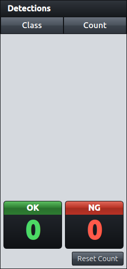
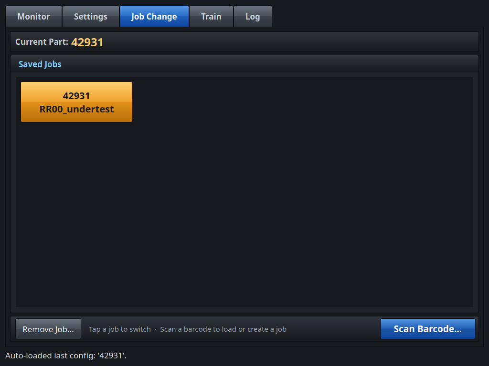
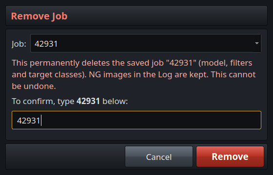
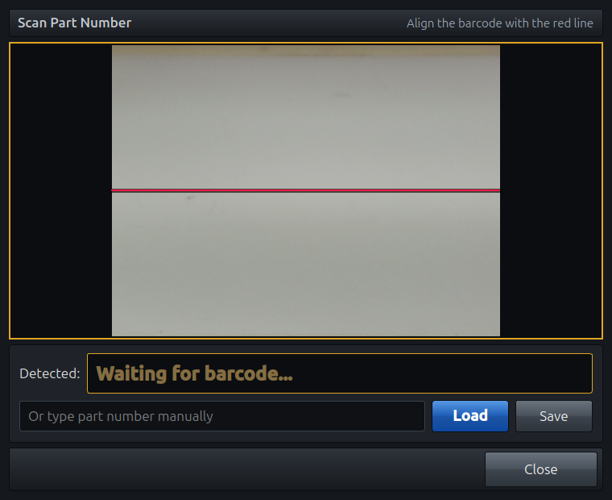
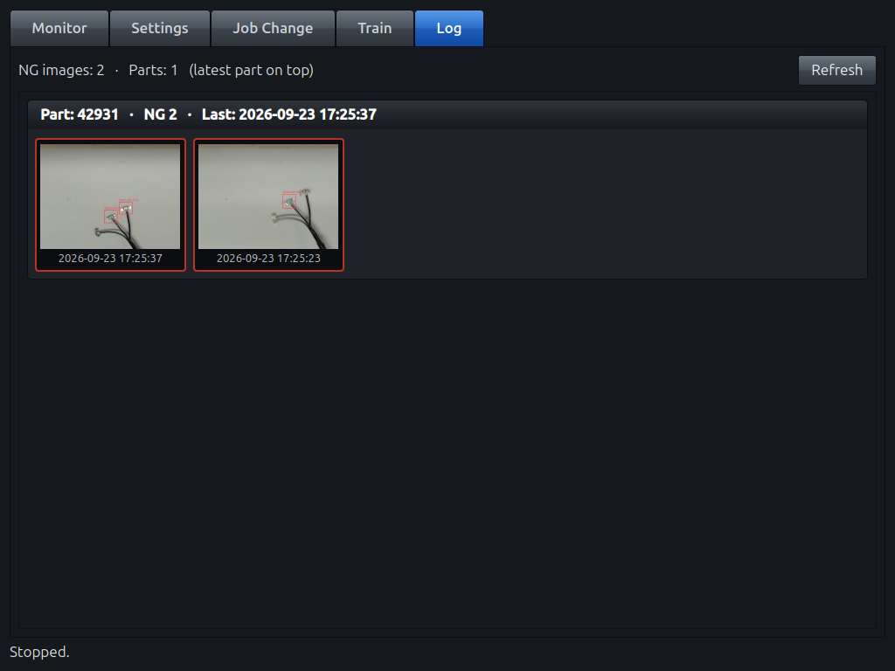
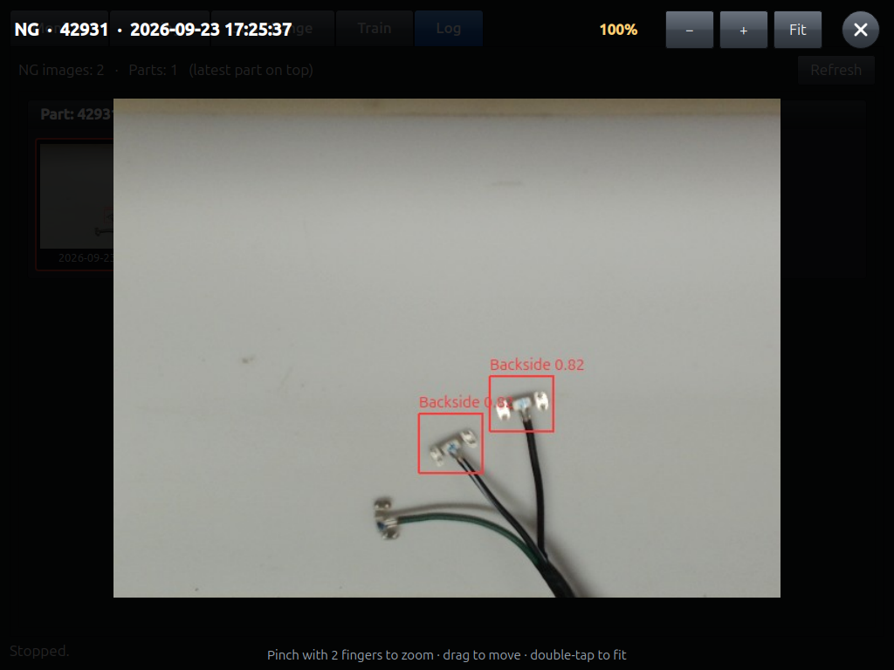
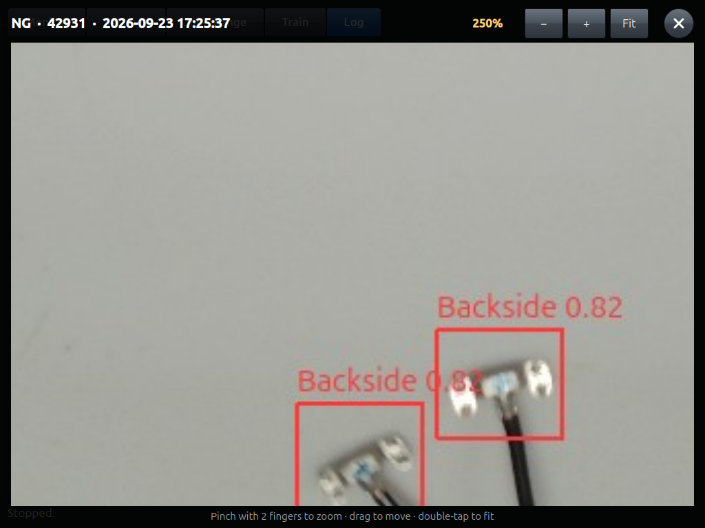
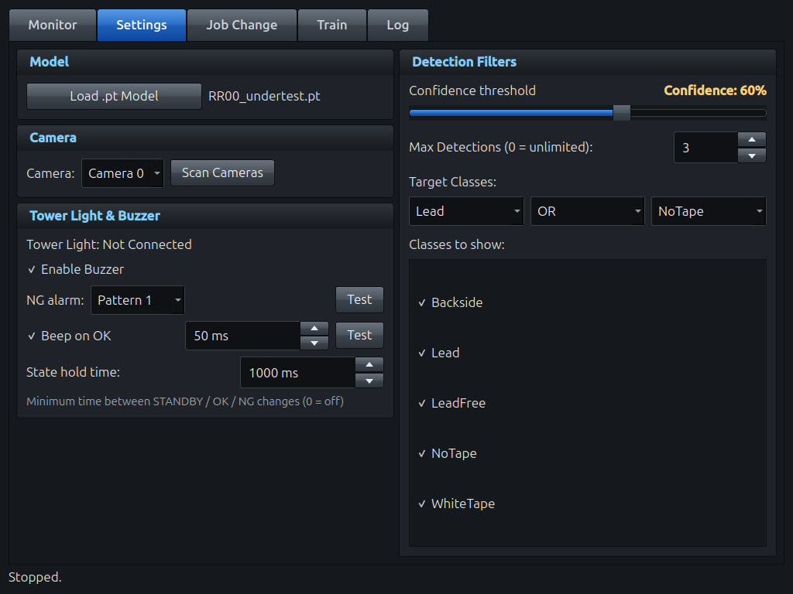
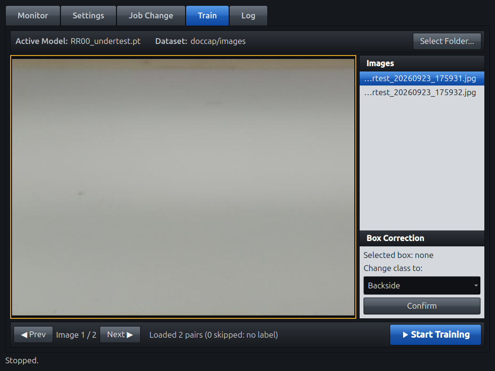

# คู่มือการใช้งาน — ระบบตรวจสอบชุดสายไฟด้วยกล้อง (UniversalV1)

[English](USER_MANUAL_EN.md) · **ภาษาไทย**

คู่มือนี้สำหรับพนักงานประจำไลน์และหัวหน้างานที่ใช้เครื่องตรวจสอบทุกวัน หน้าจอเป็นจอสัมผัส ใช้นิ้วแตะปุ่มได้ทันที หรือใช้เมาส์ก็ได้

## สารบัญ

1. [การเริ่มใช้งานประจำวัน](#1-การเริ่มใช้งานประจำวัน)
2. [แท็บ Monitor — การตรวจสอบ](#2-แท็บ-monitor--การตรวจสอบ)
3. [ความหมายของผลตรวจ (OK / NG / STANDBY)](#3-ความหมายของผลตรวจ-ok--ng--standby)
4. [แท็บ Job Change — การเปลี่ยนรหัสชิ้นงาน](#4-แท็บ-job-change--การเปลี่ยนรหัสชิ้นงาน)
5. [การสแกนบาร์โค้ด](#5-การสแกนบาร์โค้ด)
6. [แท็บ Log — ดูภาพ NG ย้อนหลัง](#6-แท็บ-log--ดูภาพ-ng-ย้อนหลัง)
7. [แท็บ Settings (สำหรับหัวหน้างาน)](#7-แท็บ-settings-สำหรับหัวหน้างาน)
8. [Capture และแท็บ Train (สำหรับหัวหน้างาน)](#8-capture-และแท็บ-train-สำหรับหัวหน้างาน)
9. [ปัญหาที่พบบ่อยและวิธีแก้](#9-ปัญหาที่พบบ่อยและวิธีแก้)

---

## 1. การเริ่มใช้งานประจำวัน

1. เปิดเครื่อง โปรแกรมจะ **เปิดเต็มจอเองอัตโนมัติ** ภายในประมาณ 1 นาที
2. ระบบจะ **โหลดงานล่าสุดที่ใช้ให้อัตโนมัติ** ให้ตรวจรหัสชิ้นงานที่มุมซ้ายบนของแท็บ Monitor
3. ถ้ารหัสชิ้นงานไม่ถูกต้อง ให้เปลี่ยนที่แท็บ **Job Change** (หัวข้อ 4)
4. กดปุ่ม **Start** สีน้ำเงินที่มุมขวาล่าง

## 2. แท็บ Monitor — การตรวจสอบ

| ตำแหน่ง | สิ่งที่แสดง |
|---|---|
| แถบบน ด้านซ้าย | **รหัสชิ้นงาน (Part)** และ **โมเดล (Model)** ที่ใช้อยู่ |
| แถบบน ด้านขวา | ป้ายผลตรวจ **OK**, **NG** หรือ **STANDBY** |
| ตรงกลาง (กรอบสีส้ม) | ภาพสดจากกล้อง พร้อมกรอบวัตถุที่ตรวจพบ |
| แผงขวา **Detections** | ชื่อคลาสที่ตรวจพบ และจำนวนที่พบ |
| แผงขวา ช่อง **OK / NG** | จำนวนรอบที่นับได้ว่า OK และ NG |
| แถบล่าง ด้านซ้าย | ปุ่ม **Capture** และ **Buzzer On/Off** |
| แถบล่าง ด้านขวา | สถานะการทำงาน และปุ่ม **Start / Stop** |

**ปุ่มต่าง ๆ**

- **Start** (สีน้ำเงิน) เริ่มเปิดกล้องและเริ่มตรวจสอบ ปุ่มจะเปลี่ยนเป็น **Stop** สีแดง และสถานะแสดง **● Running**
  - การกด Start ครั้งแรกหลังเปิดเครื่องอาจใช้เวลาประมาณ 10 วินาทีเพื่อเตรียมระบบ
- **Stop** (สีแดง) หยุดการตรวจสอบและปิดไฟสัญญาณ ปุ่มจะแสดง *Stopping…* สักครู่
- **Buzzer On / Off** ปิดหรือเปิดเสียง เมื่อปุ่มเป็น **สีส้ม** หมายถึงเปิดเสียงอยู่ ไฟสัญญาณยังทำงานตามปกติแม้ปิดเสียง
- **Capture** บันทึกภาพปัจจุบันไว้ใช้เทรนโมเดล (ดูหัวข้อ 8)

**ตัวนับ OK / NG**

- ระบบนับ 1 ครั้ง ทุกครั้งที่ผล **เปลี่ยนเป็น** OK หรือ NG
  - ชิ้นงานที่ค้างอยู่เป็น OK จะนับเพียงครั้งเดียว
  - ให้นำชิ้นงานออก (ผลกลับเป็น STANDBY) ก่อนใส่ชิ้นถัดไป เพื่อให้นับแยกทีละชิ้น
- ตัวเลขไม่หายแม้ปิดเครื่อง
- เมื่อเริ่มกะหรือล็อตใหม่ ให้กด **Reset Count** แล้วกด **Yes** เพื่อเริ่มนับจากศูนย์

## 3. ความหมายของผลตรวจ (OK / NG / STANDBY)

| ป้าย | ไฟสัญญาณ | เสียง | ความหมาย |
|---|---|---|---|
|  | 🟢 เขียว | บี๊บสั้น | พบชิ้นส่วนที่ต้องการครบ **ผ่าน** |
|  | 🔴 แดง | เสียงเตือน | ตรวจพบวัตถุ แต่ไม่ตรงตามที่งานกำหนด **ไม่ผ่าน** |
|  | 🟡 เหลือง | เงียบ | ไม่พบวัตถุ รอชิ้นงาน |

- ผลตรวจจะ **คงค้างอย่างน้อย 1 วินาที** ก่อนเปลี่ยนได้อีกครั้ง ไฟจึงไม่กะพริบไปมา และมีเวลาพอให้มองเห็นผลแต่ละครั้ง
- เมื่อพบ **NG** ให้แยกชิ้นงานออกมาตรวจสอบ ระบบบันทึกภาพ NG ไว้ในแท็บ **Log** ให้อัตโนมัติ

## 4. แท็บ Job Change — การเปลี่ยนรหัสชิ้นงาน

**งาน (Job)** 1 งาน เก็บค่าตั้งของรหัสชิ้นงาน 1 รหัส ได้แก่ โมเดล ค่ากรองการตรวจจับ และคลาสเป้าหมาย

- **Current Part** ด้านบน แสดงงานที่ใช้อยู่
- **Saved Jobs** แสดงปุ่มของแต่ละงาน พร้อมรหัสชิ้นงานและชื่อโมเดล
  - ปุ่ม **สีส้ม** คืองานที่ใช้อยู่
  - **แตะปุ่มเพื่อเปลี่ยนงาน** ระบบใช้งานใหม่ทันที
- **Scan Barcode...** (สีน้ำเงิน มุมขวาล่าง) เลือกงานโดยสแกนบาร์โค้ดของชิ้นงาน (หัวข้อ 5)

**การลบงาน (สำหรับหัวหน้างาน)**

1. กด **Remove Job...** ที่มุมซ้ายล่าง
2. เลือกงานที่ต้องการลบในช่อง **Job** (ระบบเลือกงานที่ใช้อยู่ไว้ให้ก่อน)
3. เพื่อยืนยัน ให้ **พิมพ์รหัสชิ้นงานให้ตรงทุกตัวอักษร** รวมถึงตัวพิมพ์เล็กและพิมพ์ใหญ่ ปุ่ม **Remove** สีแดงจะกดได้ก็ต่อเมื่อพิมพ์ตรงกันเท่านั้น
4. กด **Remove** เพื่อลบ หรือกด **Cancel** เพื่อยกเลิก

- ระบบลบเฉพาะงานที่บันทึกไว้เท่านั้น ภาพ NG ของรหัสนั้นยังอยู่ในแท็บ **Log**
- ถ้าลบงานที่กำลังใช้อยู่ ระบบยังตรวจด้วยค่าตั้งเดิมจนกว่าจะเลือกงานใหม่ และงานนั้นจะไม่ถูกโหลดอัตโนมัติเมื่อเปิดเครื่องอีก
- งานที่ลบแล้วกู้คืนไม่ได้ ต้องสร้างใหม่ด้วย **Scan Barcode... → Save**

## 5. การสแกนบาร์โค้ด

> ต้องกด **Stop** ที่แท็บ Monitor ก่อน เพราะกล้องใช้ได้ทีละหน้าจอเท่านั้น

1. กด **Scan Barcode...** ที่แท็บ Job Change
2. ถือบาร์โค้ดไว้หน้ากล้อง ให้ **อยู่แนวเดียวกับเส้นสีแดง**
3. เมื่ออ่านได้ รหัสชิ้นงานจะแสดงในช่อง **Detected** ตัวใหญ่
   - **มีงานของรหัสนี้อยู่แล้ว:** ระบบถาม *"Found saved config… Apply?"* ให้กด **Yes**
   - **ยังไม่มีงานของรหัสนี้:** ระบบถามว่าจะบันทึก **ค่าตั้งปัจจุบัน** เป็นงานใหม่ของรหัสนี้หรือไม่ ให้กด **Yes** เฉพาะเมื่อค่าตั้งปัจจุบันถูกต้องสำหรับชิ้นงานนี้เท่านั้น
4. ถ้าอ่านบาร์โค้ดไม่ได้ ให้พิมพ์รหัสชิ้นงานในช่องด้านล่าง
   - **Load** เปิดงานที่บันทึกไว้ของรหัสนั้น
   - **Save** บันทึกค่าตั้งปัจจุบันเป็นงานของรหัสนั้น (สำหรับหัวหน้างาน)
5. กด **Close** เมื่อเสร็จ แล้วกด **Start** ที่แท็บ Monitor

## 6. แท็บ Log — ดูภาพ NG ย้อนหลัง

- ทุกครั้งที่เกิด NG ระบบจะบันทึกภาพ ณ ขณะนั้นพร้อมกรอบวัตถุที่ตรวจพบ
- ภาพ **แยกกลุ่มตามรหัสชิ้นงาน** กลุ่มที่เกิด NG ล่าสุดอยู่ด้านบนสุด
- แต่ละกลุ่มแสดง **ภาพ NG ล่าสุด 5 ภาพ** เรียงจากใหม่ (ซ้าย) ไปเก่า พร้อมวันที่และเวลา
- กด **Refresh** เพื่อโหลดรายการใหม่

**การดูภาพ**: แตะภาพย่อ ภาพจะเปิดขนาดประมาณ 85% ของจอ

| การใช้งาน | จอสัมผัส | เมาส์ / คีย์บอร์ด |
|---|---|---|
| ซูมเข้า / ซูมออก | ใช้ **2 นิ้ว** ถ่างหรือหุบ | ลูกกลิ้งเมาส์ หรือปุ่ม **+ / −** |
| เลื่อนภาพ | ใช้ 1 นิ้วลาก | ลากเมาส์ |
| กลับขนาดพอดีจอ | แตะ 2 ครั้งเร็ว ๆ หรือกด **Fit** | ดับเบิลคลิก |
| ปิดภาพ | กด **✕** มุมขวาบน หรือแตะนอกภาพ | ปุ่ม **Esc** |

## 7. แท็บ Settings (สำหรับหัวหน้างาน)

> การเปลี่ยนค่าในแท็บนี้มีผล **ทันที** แต่ค่าการตรวจจับจะถูกเก็บเข้างาน (Job) ก็ต่อเมื่อกด **Save** งานเท่านั้น (หัวข้อ 5 ข้อ 4) ส่วนค่าเสียงและเวลาคงสถานะจะบันทึกให้อัตโนมัติ

**Model**

- **Load .pt Model** เลือกไฟล์โมเดล YOLO

**Camera**

- เลือกกล้อง ถ้าไม่พบในรายการให้กด **Scan Cameras**

**Tower Light & Buzzer (ไฟสัญญาณและเสียง)**

| ค่าตั้ง | ความหมาย |
|---|---|
| Tower Light: Connected / Not Connected | สถานะการเชื่อมต่อไฟสัญญาณ |
| **Enable Buzzer** | สวิตช์หลักของเสียง เหมือนปุ่ม **Buzzer** ในแท็บ Monitor |
| **NG alarm** + **Test** | รูปแบบเสียงเตือนเมื่อ NG กด **Test** เพื่อฟังเสียง 1 รอบ |
| **Beep on OK** + เวลา + **Test** | เสียงบี๊บสั้นยืนยันเมื่อ OK (ค่าเริ่มต้น 50 ms) |
| **State hold time** | เวลาขั้นต่ำที่ผลตรวจคงค้างก่อนเปลี่ยนได้ (ค่าเริ่มต้น 1000 ms, 0 = ปิด) |

**Detection Filters (ค่ากรองการตรวจจับ)**

| ค่าตั้ง | ความหมาย |
|---|---|
| **Confidence threshold** | ผลที่ค่าความมั่นใจต่ำกว่าค่านี้จะถูกตัดทิ้ง ค่ายิ่งสูงยิ่งเข้มงวด และตรวจจับผิดน้อยลง |
| **Max Detections** | เก็บเฉพาะ N ผลที่มั่นใจสูงสุด (0 = ไม่จำกัด) |
| **Target Classes** + **OR / AND** | คลาสที่ถือว่า **OK** เลือก **OR** = พบคลาสใดคลาสหนึ่งก็ผ่าน, **AND** = ต้องพบครบทั้งสองคลาส |
| **Classes to show** | แสดงและใช้ตัดสินผลเฉพาะคลาสที่ติ๊กไว้ |

## 8. Capture และแท็บ Train (สำหรับหัวหน้างาน)

ใช้ปรับปรุงโมเดลเมื่อโมเดลตรวจผิด

**ขั้นที่ 1 — เก็บภาพ**

- ที่แท็บ Monitor ขณะกำลังทำงาน ให้กด **Capture**
- ภาพและกรอบวัตถุจะถูกบันทึกในโฟลเดอร์ `captures/` โดยภาพอยู่ใน `images` และไฟล์ Label อยู่ใน `labels`

**ขั้นที่ 2 — แก้ไขกรอบ**

1. กด **Stop** ที่ Monitor แล้วเปิดแท็บ **Train**
2. กด **Select Folder...** แล้วเลือก `captures/images` แถบบนจะแสดง **Active Model** และ **Dataset**
3. เลือกภาพจากรายการ **Images** หรือกด **◀ Prev / Next ▶**
4. แตะกรอบบนภาพ ช่อง **Box Correction** จะแสดงกรอบที่เลือก
5. เลือกคลาสที่ถูกต้องใน **Change class to** แล้วกด **Confirm** ไฟล์ Label จะถูกแก้ไขทันที

**ขั้นที่ 3 — เทรนโมเดล**

1. กด **Start Training** (สีน้ำเงิน มุมขวาล่าง)
   - ระบบเทรน 50 รอบ (epochs) และแสดงความคืบหน้าที่แถบล่าง
   - อาจใช้เวลานาน ห้ามปิดเครื่องระหว่างเทรน
2. เมื่อเสร็จ ระบบแสดงตำแหน่งไฟล์โมเดลใหม่ อยู่ที่ `captures/runs/train…/weights/best.pt`
3. โหลดโมเดลใหม่ที่ **Settings → Load .pt Model** ทดสอบที่แท็บ Monitor แล้วกด **Save** งาน (หัวข้อ 5) เพื่อใช้โมเดลนี้ต่อไป

## 9. ปัญหาที่พบบ่อยและวิธีแก้

| ปัญหา | วิธีแก้ |
|---|---|
| หน้าจอแสดง *Tower Light: Not Connected* | ตรวจสาย USB ของไฟสัญญาณ ถ้ายังไม่ได้ให้รีสตาร์ทเครื่อง |
| กด **Start** แล้วไม่ทำงาน หรือภาพเป็นสีดำ | รอประมาณ 10 วินาทีในการเปิดครั้งแรก ถ้ายังดำอยู่ให้ตรวจสายกล้อง แล้วกด **Settings → Scan Cameras** |
| ขึ้นข้อความ *"Stop the Monitor stream before scanning"* | กด **Stop** ที่แท็บ Monitor แล้วเปิด **Scan Barcode...** ใหม่ |
| อ่านบาร์โค้ดไม่ได้ | ถือให้นิ่งบนเส้นสีแดง ลองขยับใกล้หรือไกลขึ้น และให้มีแสงสว่างพอ หรือพิมพ์รหัสแล้วกด **Load** |
| ไม่มีเสียงเมื่อ NG | ตรวจว่าปุ่ม **Buzzer On** ในแท็บ Monitor เป็นสีส้ม และไฟสัญญาณเชื่อมต่ออยู่ |
| ตรวจเป็น NG ผิดบ่อย | แจ้งหัวหน้างาน ให้ปรับ **Confidence threshold** หรือเทรนโมเดลใหม่ด้วย **Capture** และ **Train** |
| โปรแกรมปิดไปเอง | ระบบจะเปิดใหม่ให้อัตโนมัติภายในไม่กี่วินาที ถ้าปิดซ้ำบ่อย ให้แจ้งฝ่ายซ่อมบำรุง |
